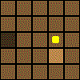
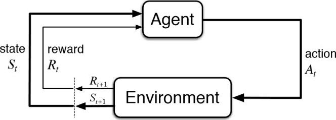

Toy construction site problem :

-> An agent moves on a discrete grid (the construction site) where each cell has an altitude ;

-> The agent can pick or drop matter to lower or higher the altitude of its current cell;

-> The goal is to level the site (all equal altitudes) as quickly as possible.

Example of solution :

This repository uses StableBaselines3 for the agents and implements a custom environment to run in.
